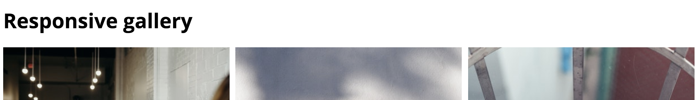
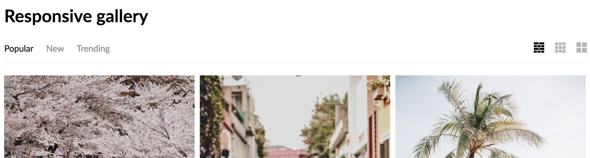
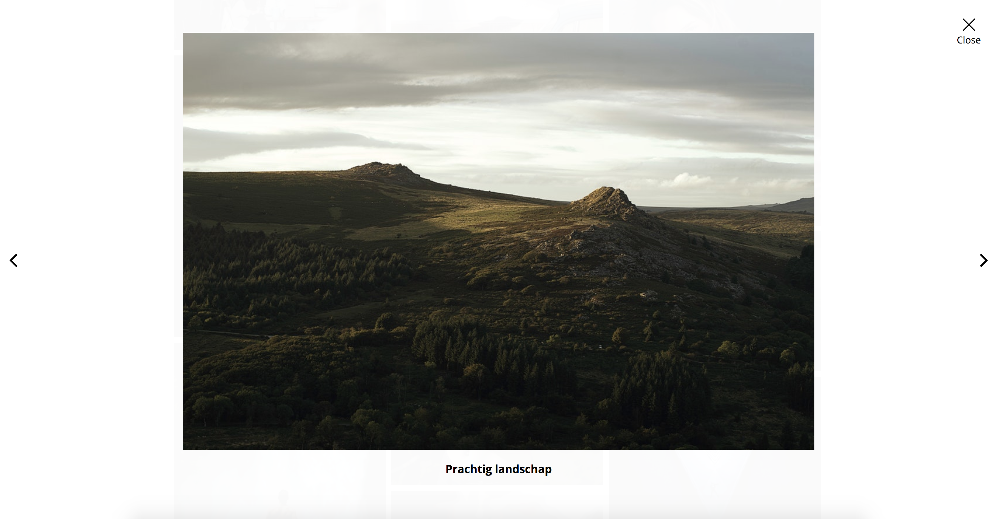
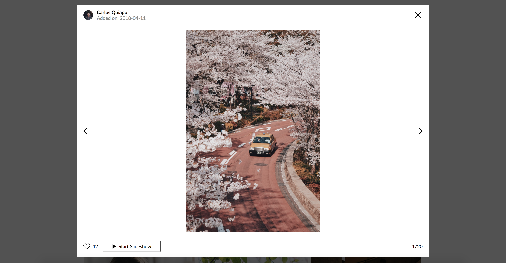

# Responsive gallery

Voor deze opdracht heb ik een use case uitgewerkt waarin de gebruiker door een overzicht van foto's heen kan scrollen, info lezen, groot kunnen bekijken en als slideshow afspelen. Hiervoor heb ik een prototype uitgewerkt in HTMl, CSS en Javascript. Tijdens dit proces heb ik door te testen een beter eindproduct kunnen realiseren.  Daarbij heb ik rekening gehouden met verschillende design principles van de Principles of User Interface Design [bron](http://bokardo.com/principles-of-user-interface-design/).

[Link naar demo](https://yoeripasmans.github.io/web-design/src/)

# Aanpassingen na feedback

In de `versie 1.0` van mijn gallery had ik nog niet de volledige functionaliteit uitgewerkt. Ik heb dus vooral getest of er dingen onduidelijk waren of misde. Daaruit bleek vooral dat als de gebruiker over de afbeeldingen heen hoverde er te weinig informatie over de afbeelding te zien was. Dit heb ik dus veranderd.

Van `versie 1.0`:

Naar `versie 2.0`:

Ook was de header erg leeg en bevatte nog niet veel functionaliteit. Daarnaast was de tekst er opgekropt en niet visueel nog niet erg sterk. Dit heb ik na de feedback dus ook toegevoegd en aangepast.

Van `versie 1.0`:

Naar `versie 2.0`:

Tenslotte was het groter bekijken van de foto nog erg kaal en bevatte nog niet de volledige functionaliteit voor het starten van de slideshow. Dit heb toegevoegd. Ook had de achtergrond van de overlay geen goed contrast met de achtergrond van de gallery, dit kwam doordat alle twee de achtergrond kleuren wit waren met een lichtere opacity. Dit heb ik naar een wat donkere achtergrond veranderd.

Van `versie 1.0`:

Naar `versie 2.0`:

## Toegepaste principes

### 11. Strong visual hierarchies work best

### 14. Progressive disclosure
Bij Progressive disclosure zorg je ervoor dat je alleen het nodige toont op het scherm en niet een overvloed van informatie en instructies toont. Dit heb ik toegepast op het overzicht van afbeeldingen, door niet gelijk alle informatie per foto weer te geven, maar de gebruiker zelf te kiezen door de informatie te tonen als de gebruiker over de afbeelding heen hovert. Zo heeft de gebruiker zelf controle over wat hij of zij wilt zien en maakt het de interactie duidelijker. Dit sluit daarom ook aan bij het principe progressive disclosure.

### 1. Clarity is job #1
Hierbij gaat het om dat de gebruiker ziet wat de interface doet en hoe hij of zij het moet gebruiken. Dit heb ik toegepast door een zo duidelijk mogelijk overzicht te geven met afbeeldingen waarbij de gebruiker door over de afbeeldingen heen te bewegen gelijk door heeft dat er een inzoom mogelijkheid is. 
