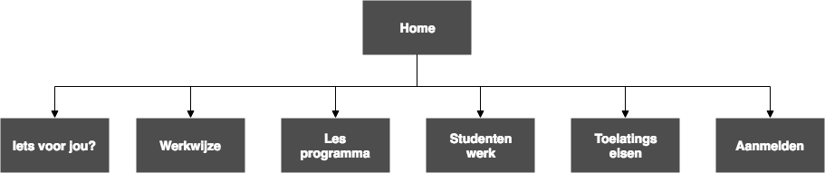

# WD Opdracht2 - Website Minor Web Development

Voor deze opdracht heb ik de bestaande website van de minor Web Development herontworpen en in HTML/CSS/Javascript uitgewerkt. Om tot een goed eindresultaat te komen heb ik tijdens het proces heb verschillende iteraties gemaakt. Door te testen op de doelgroep. Het proces hiervan wordt in deze readme toegelicht.

[Link naar demo](https://yoeripasmans.github.io/web-design/opdracht2/src)

## Aanpak
Eerst ben ik gaan kijken naar de content van de huidige website en wat voor content ik nog extra nodig had. Daarna heb ik verschillende user scenario's geschreven en gekeken naar de doelen van de gebruikers. Uit deze informatie heb ik door middel van card sorting een bijpassende structuur bedacht voor de website en daarna een sitemap opgesteld om de structuur duidelijk visueel in kaart te brengen. Ten slotte was het de opdracht om niet alleen voor de doelgroep te ontwerpen,  maar ook voor een specefiek persoon. In mijn geval was dat Marijn een motorisch gehandicapte die het liefst alleen zijn toetsenbord gebruikt. Hier heb ik dus ook rekening mee gehouden.

## Inhoud huidige website

- Titel
- Introductie
- Impressie (Foto's)
- Is deze minor voor jou?
- Lesprogramma
- Werkwijze
- Toelatingseisen
- Aanmelden
- Testimonials

## User scenario 1 - Sfeerimpressie krijgen
Het is Januari en Simon heeft nog een maand de tijd om een Minor te kiezen. Hij weet nog niet precies wat voor een richting hij op wilt, maar vind code wel vet. Hij orienteert door op verschillende sites te zoeken naar minoren.

Wat belangrijk voor hem is dat er een prettige sfeer hangt en dat hij weet of hij het niveau aankan. Door naar de nieuwe site te navigeren ziet hij gelijk een Sfeerimpressie door de afbeeldingen en leest hij de introductie door. Hierdoor krijgt hij een goed beeld over de minor.

## User scenario 2 - Aanmelden
Na lang twijfel wilt Simon nog weten wat het niveau is wat verwacht wordt. Hij klikt daarom op het kopje "Is deze minor voor jou?" en leest dat de lesstof wordt op verschillende niveau's aangeboden, afhankelijk van de kennis en skills van de student.

Dit lijkt hem wel wat. Hij klikt op "aanmelden" en vult het formulier in om aan te geven dat hij/zij interesse heeft.

## User scenario 3 - Lesprogramma bekijken

Het is Februari en Niels heeft zich twee weken geleden ingeschreven voor de Minor Webdevelopment. Hij weet nog niet precies welke vakken hij allemaal gaat volgen. Hij navigeert naar de website en klikt op "Lesprogramma". Waarin hij een duidelijk overzicht krijgt van alle vakken die hij gaat volgen.

## Gebruikers doelen:

- Sfeerimpressie krijgen van de minor.
- Erachter komen of de minor bij diegene past.
- Het les programma bekijken.
- Toelatingseisen bekijken.
- Kijken wat andere mensen tijdens deze minor hebben gemaakt.
- Aanmelden.

## Site map

## Content inventarisatie

Hierin wordt per pagina beschreven welke content er nodig is om de gebruikersdoelen te realiseren.

### Iets voor jou?
Op deze pagina wordt er met tekst beschreven wat de minor inhoudt en met afbeeldingen en sfeerimpressie gegeven.

### Werkwijze
Op deze pagina wordt er met tekst beschreven hoe er tijdens de minor gewerkt wordt.

### Lesprogramma
Op deze pagina worden verschillende tabs weergeven met daarin informatie over het desbetreffende vak. Zo krijgt de gebruiker een overzicht van alle vakken die hij of zij gaat volgen.

### Studentenwerk
Op deze pagina staat een lijst met items van diverse eindopleveringen die studenten gemaakt hebben tijdens de minor. De gebruiker moet deze items kunnen filteren en sorteren.

### Toelatingseisen
Op deze pagina wordt er met tekst beschreven wat de toelatingseisen van deze minor zijn om je te kunnen aanmelden.

### Aanmelden
Op deze pagina staat een formulier waarin de gebruiker zich kan aanmelden voor de minor.

<!-- ## Veranderingen demo na feedback

- Active states van het menu duidelijker gemaakt. (Eerst alleen underline onder text, veranderd naar dikker lettertype)
- Animatie toegevoegd aan hover states.
- Titels van secties verkleind. -->
